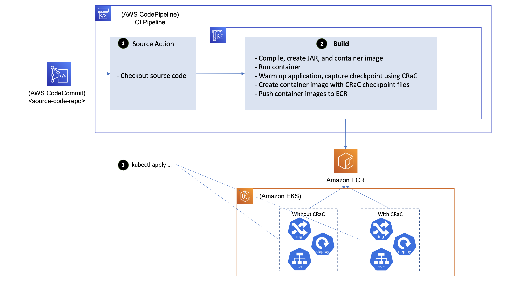

# Reduce the startup time of Java applications running on Amazon EKS using CRaC
## Introduction

In the last few years, application modernisation has become a focus area for organisations of different sizes and across industries to achieve business objectives like reduced time to market, improved cost efficiency, better customer experience, etc. Containers and containers orchestration platforms have been one of the key enablers for these modernisation initiatives. Many customers standardise on Kubernetes as a containers orchestration platform, and they use Amazon Elastic Kubernetes Service (Amazon EKS) to easily provision and manage Kubernetes clusters in the AWS cloud and on-premises data centres as well.

Many of the legacy applications being modernised are Java-based. Also, Java is one of the popular programming languages used for building new microservices leveraging frameworks like Spring Boot. Spinning up a new Java-based container sometimes suffer from extended startup time — the time needed for starting the underlying application server and various initialisation activities are usually the major contributors to that. Extended startup time means less responsiveness to scale out events — it also negatively impacts operational activities like worker nodes recycling where several containers are terminated and rescheduled on a new worker nodes at the same time and contend on resources.

CRaC (Coordinated Restore at Checkpoint) is an OpenJDK feature that provides a fast start and immediate performance for Java applications — it allows for starting a Java application and JVM from an image in a warmed-up form. The image is created from a running Java instance at arbitrary point of time ("checkpoint"). The start from the image ("restore") continues from the point when checkpoint was made.

In this sample implementation, we demonstrate how CRaC can be leveraged in a CI pipeline built using Amazon CodePipeline and Amazon CodeBuild to create a warmed-up container image of the application, then deploy it into Amazon EKS.

## Solution overview


## Implementation steps

1. Set the environment variables that will be used in the subsequent steps:
```
export INITIALS=im #replace with your initials
export AWS_REGION=$(curl -s 169.254.169.254/latest/dynamic/instance-identity/document | jq -r '.region')
export ACCOUNT_ID=$(aws sts get-caller-identity --output text --query Account)
export SRVC_NAME=springdemo
export SRVC_JAR_FILENAME=CustomerService-0.0.1.jar
```

2. Clone the sample implementation repo

**NOTE:** As the sample implementation is not added to GitHub yet, you will have to download from GitLab and upload manually to Cloud9 rather than executing the command below.

```
git clone https://github.com/aws-samples/aws-eks-crac.git
```

3. Create the S3 bucket where the CloudFormation templates will be uploaded
```
aws s3api create-bucket \
    --bucket aws-eks-crac-${INITIALS} \
    --region ${AWS_REGION} \
    --create-bucket-configuration LocationConstraint=${AWS_REGION}
```

4. Load CloudFormation templates to S3

```
cd ~/environment/aws-eks-crac/framework/cmn/cfn
aws s3 sync . s3://aws-eks-crac-${INITIALS}

cd ~/environment/aws-eks-crac/examples/springdemo/cfn
aws s3 sync . s3://aws-eks-crac-${INITIALS}
```

5. Deploy the cloud resources that the sample service depends on, and the CI pipeline

```
aws cloudformation create-stack --stack-name ${SRVC_NAME} \
 --template-url  https://aws-eks-crac-${INITIALS}.s3.${AWS_REGION}.amazonaws.com/${SRVC_NAME}-main.yaml \
 --parameters \
 ParameterKey=ServiceName,ParameterValue=${SRVC_NAME} \
 ParameterKey=CfnS3Bucket,ParameterValue=aws-eks-crac-${INITIALS} \
 ParameterKey=ServiceJarFilename,ParameterValue=${SRVC_JAR_FILENAME} \
 --capabilities CAPABILITY_IAM CAPABILITY_NAMED_IAM
```

You can update the created stack with the following command:
```
aws cloudformation update-stack --stack-name ${SRVC_NAME} \
 --template-url  https://aws-eks-crac-${INITIALS}.s3.${AWS_REGION}.amazonaws.com/${SRVC_NAME}-main.yaml \
 --parameters \
 ParameterKey=ServiceName,ParameterValue=${SRVC_NAME} \
 ParameterKey=CfnS3Bucket,ParameterValue=aws-eks-crac-${INITIALS} \
 ParameterKey=ServiceJarFilename,ParameterValue=${SRVC_JAR_FILENAME} \
 --capabilities CAPABILITY_IAM CAPABILITY_NAMED_IAM
```

6. Once the CloudFormation stack is created, clone the service repo and prepare it — this involves adding the service source code and the scripts that facilitate performing and restoring checkpoints using CRaC).

**NOTE:** You may need to install git-remote-codecommit for connecting to CodeCommit repo using IAM credentials. If you are using Cloud9, it is already installed for you.

```
cd ~/environment
git clone https://git-codecommit.${AWS_REGION}.amazonaws.com/v1/repos/${SRVC_NAME}
```

Copy the source code and CRaC scripts
```
cd ~/environment
cp -r aws-eks-crac/examples/${SRVC_NAME}/code/* ${SRVC_NAME}/
cp aws-eks-crac/framework/template/codebuild/buildspec.yml ${SRVC_NAME}/
cp -r aws-eks-crac/framework/template/dockerfiles ${SRVC_NAME}
cp -r aws-eks-crac/framework/template/scripts ${SRVC_NAME}
```

Commit the changes

**NOTE:** You may need to click release change button in CodePipeline through the console for the first commit to be picked up by CodePipeline

```
cd ~/environment/${SRVC_NAME}
git add .
git commit -m "initial version"
git push
```

7.  Observe CodePipeline progress through the console

**NOTE:** It may happen that the CodeBuild stage fails because of 503 HTTP error that is occasionally returned from https://get.sdkman.io (resources are downloaded from this URL as part of the container image build); if this error occurred to you, retry the CodeBuild stage through the console.

8. Once CodePipeline is completed, check the container images produced in the ECR repo springdemo; you should find two container images: `v1` and `v1-checkpoint` (contains CRaC checkpoint files).

9. Apply two K8s deployments; one that refers to `v1` (starts from scratch), and the other refers `v1-checkpoint` (starts from checkpoint).

**NOTE:** The yq commands below are not working, so please update the YAML files manually till the issue is fixed.

```
cd ~/environment/
export SRVC_IMAGE_WO_CRAC=$(aws ecr describe-repositories --repository-name springdemo --query 'repositories[0].repositoryUri' --output text)":"$(aws ecr describe-images --output text --repository-name $SRVC_NAME --query 'sort_by(imageDetails,& imagePushedAt)[-2].imageTags[0]') # the order of build commands means the second last image is always the base
export SRVC_IMAGE=$(aws ecr describe-repositories --repository-name springdemo --query 'repositories[0].repositoryUri' --output text)":"$(aws ecr describe-images --output text --repository-name $SRVC_NAME --query 'sort_by(imageDetails,& imagePushedAt)[-1].imageTags[0]') # the order of build commands means the latest image is always the checkpoint
sed -i "s|SRVC_IMAGE_WO_CRAC|$SRVC_IMAGE_WO_CRAC|" aws-eks-crac/examples/springdemo/k8s/deployment-wo-crac.yaml
sed -i "s|SRVC_IMAGE|$SRVC_IMAGE|" aws-eks-crac/examples/springdemo/k8s/deployment.yaml
kubectl apply -f aws-eks-crac/examples/springdemo/k8s
```

10. Calculate the startup time for v1 by checking the pod logs (expected to be around 10 seconds)

```
kubectl logs -l app=spring-boot-ddb-wo-crac
```

11. Calculate the startup time for v1-checkpoint by checking the pod logs (expected to be around 400 ms!)

```
kubectl logs -l app=spring-boot-ddb
```

12. Test the service started from scratch
```
kubectl exec -it $(kubectl get pod -l app=spring-boot-ddb-wo-crac -o name) -- /bin/bash
curl -v -d '{"name":"hmueller", "email":"hm@muelle.com", "accountNumber": "243423"}' -H "Content-Type: application/json" -X POST http://localhost:8080/api/customers
curl http://localhost:8080/api/customers
```


13. Test the service restored from checkpoint
```
kubectl exec -it $(kubectl get pod -l app=spring-boot-ddb -o name) -- /bin/bash
curl http://localhost:8080/api/customers
```


## Security

See [CONTRIBUTING](CONTRIBUTING.md#security-issue-notifications) for more information.

## License

This library is licensed under the MIT-0 License. See the LICENSE file.


