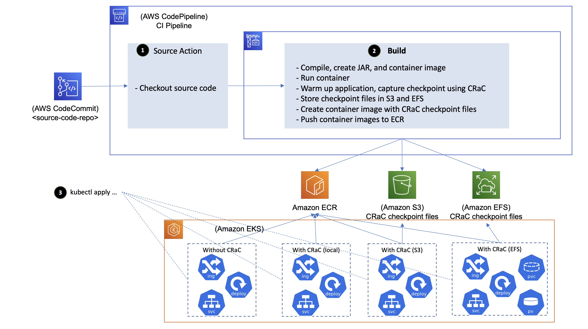

# Reduce the startup time of Java applications running on Amazon EKS using CRaC
## Introduction

In the last few years, application modernisation has become a focus area for organisations of different sizes and across industries to achieve business objectives like reduced time to market, improved cost efficiency, better customer experience, etc. Containers and containers orchestration platforms have been one of the key enablers for these modernisation initiatives. Many customers standardise on Kubernetes as a containers orchestration platform, and they use Amazon Elastic Kubernetes Service (Amazon EKS) to easily provision and manage Kubernetes clusters in the AWS cloud and on-premises data centres as well.

Many of the legacy applications being modernised are Java-based. Also, Java is one of the popular programming languages used for building new microservices leveraging frameworks like Spring Boot. Spinning up a new Java-based container sometimes suffer from extended startup time — the time needed for starting the underlying application server and various initialisation activities are usually the major contributors to that. Extended startup time means less responsiveness to scale out events — it also negatively impacts operational activities like worker nodes recycling where several containers are terminated and rescheduled on a new worker nodes at the same time and contend on resources.

CRaC (Coordinated Restore at Checkpoint) is an OpenJDK feature that provides a fast start and immediate performance for Java applications — it allows for starting a Java application and JVM from an image in a warmed-up form. The image is created from a running Java instance at arbitrary point of time ("checkpoint"). The start from the image ("restore") continues from the point when checkpoint was made.

In this sample implementation, we demonstrate how CRaC can be leveraged in a CI pipeline built using Amazon CodePipeline and Amazon CodeBuild to create a warmed-up container image of the application, then deploy it into Amazon EKS.

## Solution
### Architecture overview
The diagram below depicts the architecture of the sample implementation:


The CI pipeline is extended to run the new version of the code, warm it up, capture a checkpoint using CRaC, and publish a container image with CRaC checkpoint files to the containers registry (Amazon ECR). The application is started on the target environment by restoring it from the checkpoint files rather than starting it from scratch leading to significant reduction in startup time, and elimination of the spike in compute resources consumption that is usually observed at Java applications startup time.

The flow is as follows:
1. After the commit of a new version of the code, the CI pipeline on AWS CodePipeline checks out the source code
2. A build run on AWS CodeBuild is initiated and performs the following:
    * Compiles the new version of the code producing a JAR file, and creates an image that contains the JAR file
    * Runs a container from the image with the application running inside
    * Warms up the application by sending traffic that simulate the traffic expected in the target environment, then capture a checkpoint
    * Creates an image that contains the JAR file and CRaC checkpoint files
    * Pushes the images to Amazon ECR
3. K8s manifests that deploys the application are applied to Amazon EKS clusters that comprises that target environment. For comparison purposes, two deployments are created; one that points to the image without CRaC checkpoint files where the application is started from scratch, and the other deployment points to the image with CRaC checkpoint files where the application is started by restoring it from the captured checkpoint.

### Externalize checkpoint files
Some organisations may want to refrain from keeping checkpoint files in the container image; reasons for that include:
- Reducing the container image size
- Not changing the nature of data stored in ECR to contain microservices in-memory data, and avoiding revisiting the configured security controls that would be needed otherwise

To migitate these concerns, consider the following (depicted in the diagram below):
- Storing the checkpoint files in EFS, and mounting it in the pod. We observed that restoring the sample Java process take 2 seconds when the checkpoint files are stored in EFS versus 0.3 seconds when the checkpoint files are part of the container image.
- Storing the checkpoint files in S3, and syncing to the pod filesystem at start-up time. We observed that the sync operations takes 6 seconds for checkpoint files of size 170 MB on worker nodes of m5.large (public S3 endpoint was used for this testing).



The CI pipeline is further extended to store CRaC checkpoint files in Amazon EFS and Amazon S3.

To reduce the latency introduced by externalizing the checkpoint files (1.7 seconds in case of EFS, and 6 seconds in case of S3), consider syncing the checkpoint files for microservices into the worker node file system as part of the worker node provisioning, and mounting that into pods as local persistent volumes.

### Configuration management
Configurations are string values that inform how your code executes; those that can change from an environment to another e.g. database strings, backend systems credentials, HTTP endpoints, mode, etc.

If the checkpoint is captured on an environment (e.g. CI environment) that is different from the one it will be restored on (e.g. prod environment), the configurations need to updated as part of the checkpoint restoration to match the target environment (this is not needed if the environments where the checkpoint is captured and restored are the same).

There are several mechanisms that can be used for configuration management in Java – this includes OS environment variables, command line parameters, Java system properties, and configuration files (e.g. application.properties files for Spring applications). The values of the OS environment variables in application restored from a checkpoint are those of the environment where the checkpoint is captured; the same challenge exists in case of command line parameters.

Spring Framework provides [Environment Abstraction](https://docs.spring.io/spring-framework/reference/core/beans/environment.html) for facilitating configuration management; it supports various configuration management mechanisms – this includes: OS environment variables, Java system properties, and other mechanisms.

In this sample implementation, one of the configurations is `mode` that controls how the AWS credentials are obtained; on CI environment it is set `ci`, and on the target environment, it is set `prod`. The code uses Environment Abstraction provided by Spring Framework for accessing configurations that are defined as Java system properties in this sample implementation.

### AWS credentials
This sample implementation uses DynamoDB as a persistence layer. For the application to interact with DynamoDB, it needs AWS credentials.

In CI environment, an IAM role is assumed, and temp credentials are provided to the application as OS environment variables. So, EnvironmentVariableCredentialsProvider is used as credentials provider.

The target environment is based on Amazon EKS i.e. IAM roles for service accounts (IRSA) needs to be used for interacting with AWS API. So, WebIdentityTokenFileCredentialsProvider is used as credentials provider in this case.

The configuration `mode` is used to instruct the code whether to use EnvironmentVariableCredentialsProvider or WebIdentityTokenFileCredentialsProvider.

Some customers prefer to capture the checkpoint on the same environment it will be restored on to avoid the complexity involved in changing configurations and managing AWS credentials.

### Containers security
This sample implementation uses OpenJDK distribution produced by Azul that supports CRaC, and leverages CRIU for checkpoint/restore functionality.

Earlier, CRIU needed extended system capabilities for capturing/restoring checkpoints (`CAP_SYS_ADMIN`), which was not ideal. CRIU team worked with the Linux kernel team on introducing `CAP_CHECKPOINT_RESTORE`, a new capability for facilitating checkpoint/restore for non-root users, and eliminating the need for granting `CAP_SYS_ADMIN` capability. So, it is no longer required to run the Java application (restored from a checkpoint) in privileged mode or with `CAP_SYS_ADMIN` capability; only `CAP_CHECKPOINT_RESTORE` and `SYS_PTRACE` capabilities are required.

Please note that `CAP_CHECKPOINT_RESTORE` system capability was introduced in Linux kernel 5.9, while CodeBuild underlying instances are running Linux kernel 4.14. So, docker was run within CodeBuild in privileged mode for the purpose of capturing checkpoint. On the target environment (Amazon EKS) though, worker nodes are running Linux Kernel 5.10 (> 5.9). So, the narrowed down system capabilities (`CAP_CHECKPOINT_RESTORE` and `SYS_PTRACE`) were used.

Please note that AWS Fargate is not supported as it only supports adding the `SYS_PTRACE` kernel capability; `CAP_SYS_ADMIN` and `CAP_CHECKPOINT_RESTORE` cannot be added.

## Implementation steps
**NOTE:** The steps below have been tested on Cloud9 (Amazon Linux 2); some tweaks might be required if you use another environment. If you are using Cloud9, make sure to disable AWS managed temporary credentials and attach an IAM role with sufficient permissions.

1. Set working directory environment variable. If you are not using Cloud9, make sure to change the path below to match an existing path in your system
```
export WORK_DIR=~/environment
echo "export WORK_DIR=${WORK_DIR}" | tee -a ~/.bash_profile
```
2. Clone the sample implementation repo
```
git clone https://github.com/aws-samples/aws-eks-crac.git
```

3. Deploy the base setup of the solution via CDK (includes an EKS cluster, EFS file system and S3 bucket for storing the checkpoint files, and S3 bucket for storing the CI CloudFormation templates)

**NOTE:** The CDK application is configuring the EFS security group to allow inbound connections from any IPv4 address for the time being; this needs to be narrowed down to CI (CodeBuild) and EKS.

First, CDK must be bootstrapped prior to deploying stacks. Bootstrapping is a process of creating IAM roles and Lambda functions that can execute some of the common CDK constructs. The following must be run once, in the account where the stack is deployed.
```
cd "${WORK_DIR}/aws-eks-crac/base"
npm install
cdk bootstrap
``` 

Once CDK is bootstrapped, the base setup is deployed and updated with the following command:

```
cdk deploy --all
```

Once CDK has completed the deployment, CDK outputs the commands to update your kubeconfig in order to access the cluster. Take note of the cluster role.

This cluster is configured with Karpenter as the node provisioner. After the creation of the cluster, the Karpenter add-on is setup and the provisioner must be created. This is done with the following command:
```
kubectl apply -f post-cluster/karpenter-provisioner.yaml
```

Please check these links for more details about EKS Blueprints
* https://aws-quickstart.github.io/cdk-eks-blueprints/getting-started/
* https://github.com/aws-samples/cdk-eks-blueprints-patterns

4. Set the environment variables that will be used in the subsequent steps:

**NOTE:** The value used for setting AWS_REGION is extracted from IMDSv1. If you are not running on Cloud9/EC2 instance, replace the curl command with the name of the AWS region you use e.g. `eu-west-1`.

```
export AWS_REGION="$(curl -s http://169.254.169.254/latest/meta-data/placement/availability-zone | sed 's/\(.*\)[a-z]/\1/')"
export ACCOUNT_ID="$(aws sts get-caller-identity --output text --query Account)"
export SRVC_JAR_FILENAME=CustomerService-0.0.1.jar
export CLUSTER_NAME=eks-crac-cluster-stack

export VPC_ID="$(aws cloudformation describe-stacks --stack-name BaseStack --query 'Stacks[0].Outputs[?OutputKey==`VpcId`].OutputValue' --output text)"
export CI_SG_ID="$(aws cloudformation describe-stacks --stack-name BaseStack --query 'Stacks[0].Outputs[?OutputKey==`CiSgId`].OutputValue' --output text)"
export VPC_PRIVATE_SUBNET_IDS="$(aws cloudformation describe-stacks --stack-name BaseStack --query 'Stacks[0].Outputs[?OutputKey==`VpcPrivateSubnetIds`].OutputValue' --output text)"
export VPC_PRIVATE_SUBNET_IDS_ESC="$(echo $VPC_PRIVATE_SUBNET_IDS | sed 's/\,/\\\,/g')"

export EFS_DNS="$(aws cloudformation describe-stacks --stack-name BaseStack --query 'Stacks[0].Outputs[?OutputKey==`CracCheckpointsFileSystemDns`].OutputValue' --output text)"
export EFS_ID="$(aws cloudformation describe-stacks --stack-name BaseStack --query 'Stacks[0].Outputs[?OutputKey==`CracCheckpointsFileSystemId`].OutputValue' --output text)"

export CRAC_CF_S3="$(aws cloudformation describe-stacks --stack-name BaseStack --query 'Stacks[0].Outputs[?OutputKey==`CracCfS3`].OutputValue' --output text)"
export CRAC_CHECKPOINTS_S3="$(aws cloudformation describe-stacks --stack-name BaseStack --query 'Stacks[0].Outputs[?OutputKey==`CracCheckpointsS3`].OutputValue' --output text)"

echo "export ACCOUNT_ID=${ACCOUNT_ID}" | tee -a ~/.bash_profile
echo "export AWS_REGION=${AWS_REGION}" | tee -a ~/.bash_profile
echo "export SRVC_JAR_FILENAME=${SRVC_JAR_FILENAME}" | tee -a ~/.bash_profile
echo "export CLUSTER_NAME=${CLUSTER_NAME}" | tee -a ~/.bash_profile
echo "export VPC_ID=${VPC_ID}" | tee -a ~/.bash_profile
echo "export CI_SG_ID=${CI_SG_ID}" | tee -a ~/.bash_profile
echo "export VPC_PRIVATE_SUBNET_IDS=${VPC_PRIVATE_SUBNET_IDS}" | tee -a ~/.bash_profile
echo "export VPC_PRIVATE_SUBNET_IDS_ESC=${VPC_PRIVATE_SUBNET_IDS_ESC}" | tee -a ~/.bash_profile
echo "export EFS_DNS=${EFS_DNS}" | tee -a ~/.bash_profile
echo "export EFS_ID=${EFS_ID}" | tee -a ~/.bash_profile
echo "export CRAC_CF_S3=${CRAC_CF_S3}" | tee -a ~/.bash_profile
echo "export CRAC_CHECKPOINTS_S3=${CRAC_CHECKPOINTS_S3}" | tee -a ~/.bash_profile
```

5. Load CI CloudFormation templates to S3

```
cd "${WORK_DIR}/aws-eks-crac/examples/cmn/cfn"
aws s3 sync . "s3://${CRAC_CF_S3}"
```

6. Create the `StorageClass`, `PersistentVolume`, and `PersistentVolumeClaim` for EFS file system that contains the checkpoint files
```
cd "${WORK_DIR}"
envsubst < aws-eks-crac/examples/cmn/k8s/efs-mount.yaml | kubectl apply -f -
```

7. Set the `SRVC_NAME` environment variable
```
export SRVC_NAME=springdemo-native-int
```

**NOTE:** This repo contains two CRaC implementations for a sample Spring Boot application; one is based on the native integration with CRaC introduced in Spring version 6.1 (and Spring Boot version 3.2), and the other is based the general mechanism that CRaC provides -- if you want to use the former set `SRVC_NAME` to `springdemo-native-int`; if you want to use the latter, set `SRVC_NAME` to `springdemo`.

8. Deploy the cloud resources that the sample service depends on, and the CI pipeline

```
aws cloudformation create-stack --stack-name "${SRVC_NAME}" \
 --template-url  "https://${CRAC_CF_S3}.s3.${AWS_REGION}.amazonaws.com/springdemo-main.yaml" \
 --parameters \
 ParameterKey=ServiceName,ParameterValue="${SRVC_NAME}" \
 ParameterKey=CfnS3Bucket,ParameterValue="${CRAC_CF_S3}" \
 ParameterKey=ServiceJarFilename,ParameterValue="${SRVC_JAR_FILENAME}" \
 ParameterKey=CracCheckpointsBucket,ParameterValue="${CRAC_CHECKPOINTS_S3}" \
 ParameterKey=VpcId,ParameterValue="${VPC_ID}" \
 ParameterKey=VpcSubnetIds,ParameterValue="${VPC_PRIVATE_SUBNET_IDS_ESC}" \
 ParameterKey=SecurityGroupIds,ParameterValue="${CI_SG_ID}" \
 ParameterKey=EfsDns,ParameterValue="${EFS_DNS}" \
 --capabilities CAPABILITY_IAM CAPABILITY_NAMED_IAM
```

9. Once the CloudFormation stack creation is completed (you can check via the console or the CLI), clone the service repo and prepare it — this involves adding the service source code and the scripts that facilitate performing and restoring checkpoints using CRaC).

**NOTE:** You may need to [install git-remote-codecommit](https://docs.aws.amazon.com/codecommit/latest/userguide/setting-up-git-remote-codecommit.html) for connecting to CodeCommit repo using IAM credentials. If you are using Cloud9, it is already installed for you.

```
cd "${WORK_DIR}"
git clone "https://git-codecommit.${AWS_REGION}.amazonaws.com/v1/repos/${SRVC_NAME}"
```

Create the branch `main`, and copy the source code and CRaC scripts
```
cd "${WORK_DIR}/${SRVC_NAME}"
git checkout -b main
cp -r ../aws-eks-crac/examples/"${SRVC_NAME}"/code/* .
cp ../aws-eks-crac/examples/cmn/codebuild/buildspec.yml .
cp -r ../aws-eks-crac/examples/cmn/dockerfiles .
cp -r ../aws-eks-crac/examples/${SRVC_NAME}/scripts .
```

Commit the changes

```
cd "${WORK_DIR}/${SRVC_NAME}"
git add .
git commit -m "initial version"
git push --set-upstream origin main
```

10.  Observe CodePipeline progress through the console

**NOTE:** It may happen that the CodeBuild stage fails because of 503 HTTP error that is occasionally returned from https://get.sdkman.io (resources are downloaded from this URL as part of the container image build); if this error occurred to you, retry the CodeBuild stage through the console.

11. Once CodePipeline is completed, check the container images produced in the ECR repo springdemo; you should find two container images: `v1` and `v1-checkpoint` (contains CRaC checkpoint files).

12. Apply K8s manifests for deploying the sample application into the cluster

**NOTE:** The mainfests covers 4 deployments:
- `<SRVC_NAME>-crac-efs-mount`: checkpoint files are retrieved from EFS
- `<SRVC_NAME>-crac-s3-cli`: checkpoint files are retrieved from S3
- `<SRVC_NAME>-crac`: checkpoint files are part of the container image
- `<SRVC_NAME>-nocrac`: application is started from scratch i.e. checkpoint is not used

```
cd "${WORK_DIR}"

export SRVC_IMAGE_NOCRAC="$(aws ecr describe-repositories --repository-name ${SRVC_NAME} --query 'repositories[0].repositoryUri' --output text)":"$(aws ecr describe-images --output text --repository-name $SRVC_NAME --query 'sort_by(imageDetails,& imagePushedAt)[-2].imageTags[0]')" # the order of build commands means the second last image is always the base
export SRVC_IMAGE="$(aws ecr describe-repositories --repository-name ${SRVC_NAME} --query 'repositories[0].repositoryUri' --output text)":"$(aws ecr describe-images --output text --repository-name $SRVC_NAME --query 'sort_by(imageDetails,& imagePushedAt)[-1].imageTags[0]')" # the order of build commands means the latest image is always the checkpoint
export SRVC_VERSION="$(aws ecr describe-images --output text --repository-name $SRVC_NAME --query 'sort_by(imageDetails,& imagePushedAt)[-2].imageTags[0]')"

kubectl kustomize aws-eks-crac/examples/cmn/k8s/springdemo \
  | envsubst | kubectl apply -f-
```

If you made a change, and a new version of the container image is published through the CI pipeline, re-run the snippet above to update the environment variables and re-apply the manifests to the cluster.

13. Wait till the ALBs are in `Active` state, then test the various deployments of the application using the snippet below:
```
export APP_HOSTNAME="$(kubectl get ingress $SRVC_NAME-nocrac-ingress -o jsonpath='{.status.loadBalancer.ingress[0].hostname}')"
curl -d '{"name":"islam", "email":"islam@mahgoub.com", "accountNumber": "1234567"}' -H "Content-Type: application/json" -X POST http://${APP_HOSTNAME}/api/customers
curl "http://${APP_HOSTNAME}/api/customers"

export APP_CRAC_HOSTNAME="$(kubectl get ingress $SRVC_NAME-crac-ingress -o jsonpath='{.status.loadBalancer.ingress[0].hostname}')"
curl "http://${APP_CRAC_HOSTNAME}/api/customers"

export APP_CRAC_EFS_HOSTNAME="$(kubectl get ingress $SRVC_NAME-crac-efs-mount-ingress -o jsonpath='{.status.loadBalancer.ingress[0].hostname}')"
curl "http://${APP_CRAC_EFS_HOSTNAME}/api/customers"

export APP_CRAC_S3_HOSTNAME="$(kubectl get ingress $SRVC_NAME-crac-s3-cli-ingress -o jsonpath='{.status.loadBalancer.ingress[0].hostname}')"
curl "http://${APP_CRAC_S3_HOSTNAME}/api/customers"
```


14. Calculate the startup time for various deployments by checking timestamps in the pod logs.

```
kubectl logs --tail 100 -l app="$SRVC_NAME-nocrac"
kubectl logs --tail 100 -l app="$SRVC_NAME-crac"
kubectl logs --tail 100 -l app="$SRVC_NAME-crac-efs-mount"
kubectl logs --tail 100 -l app="$SRVC_NAME-crac-s3-cli"
```
## Results
The results for the implementation that is based on the general approach provided by CRaC are as follows:
Deployment | Checkpoint files size (MB) | Image size on ECR (MB) | Time to download Checkpoint files (Seconds) | Startup time (Seconds) | Total startup time (Seconds) 
--- | --- | --- | --- |--- |--- 
No CRaC | - | ... | - | 9.353 | 9.353
CRaC - Container image | 167.6 | ... | - | 0.344 | 0.344
CRaC - EFS | 167.6 | ... | - | 1.013 | 1.013
CRaC - S3 CLI | 167.6 | ... | 2.72 | 0.368 | 3.088

The results for the implementation that is based on Spring Boot native integration with CRaC are as follows:
Deployment | Checkpoint files size (MB) | Image size on ECR (MB) | Time to download Checkpoint files (Seconds) | Startup time (Seconds) | Total startup time (Seconds) 
--- | --- | --- | --- |--- |--- 
No CRaC | - | ... | - | 10.696 | 10.696
CRaC - Container image | 157.9 | ... | - | 0.736 | 0.736
CRaC - EFS | 157.9 | ... | - | 1.826 | 1.826
CRaC - S3 CLI | 157.9 | ... | 3.265 | 0.643 | 3.908

**NOTE:** The reduction in start-up time in case of Spring Boot native integration with CRaC is lower compared to the general approach; one of the reasons behind that is the captured checkpoint in case of Spring Boot native integration with CRaC only covers the Spring Boot framework, not the application.

## Clean-up
1. Undeploy the sample service from the EKS cluster
```
cd "${WORK_DIR}"
kubectl kustomize aws-eks-crac/examples/cmn/k8s/springdemo \
  | envsubst | kubectl delete -f-
```

2. Delete the sample service container images pushed to ECR
```
aws ecr batch-delete-image \
    --repository-name "$SRVC_NAME" \
    --image-ids "$(aws ecr list-images --repository-name $SRVC_NAME --query 'imageIds[*]' --output json
)" || true
```

3. Delete the cloud resources that the sample service depends on, and the CI pipeline
```
aws cloudformation delete-stack --stack-name "$SRVC_NAME"
```

4. Delete the sample application directory
```
cd "${WORK_DIR}"
rm -r -f "$SRVC_NAME"
```

5. Delete the `StorageClass`, `PersistentVolume`, and `PersistentVolumeClaim` for EFS file system that contains the checkpoint files
```
cd "${WORK_DIR}"
envsubst < aws-eks-crac/examples/cmn/k8s/efs-mount.yaml | kubectl delete -f -
```

6. Delete Karpenter provisioner and allow sufficient time for de-provisioning any nodes that may have been provisioned by Karpenter
```
cd "${WORK_DIR}/aws-eks-crac/base"
kubectl delete -f post-cluster/karpenter-provisioner.yaml
```

7. Delete the base setup of the solution created via CDK
```
cd "${WORK_DIR}/aws-eks-crac/base"
cdk destroy --all
```

## Security

See [CONTRIBUTING](CONTRIBUTING.md#security-issue-notifications) for more information.

## License

This library is licensed under the MIT-0 License. See the LICENSE file.
